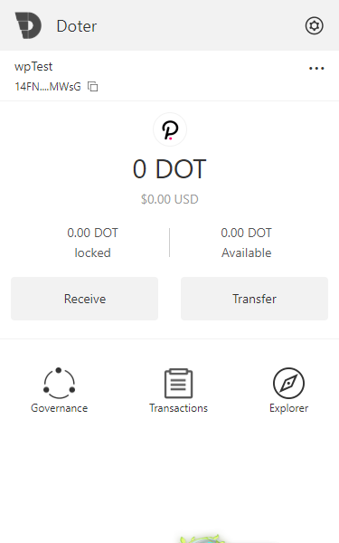
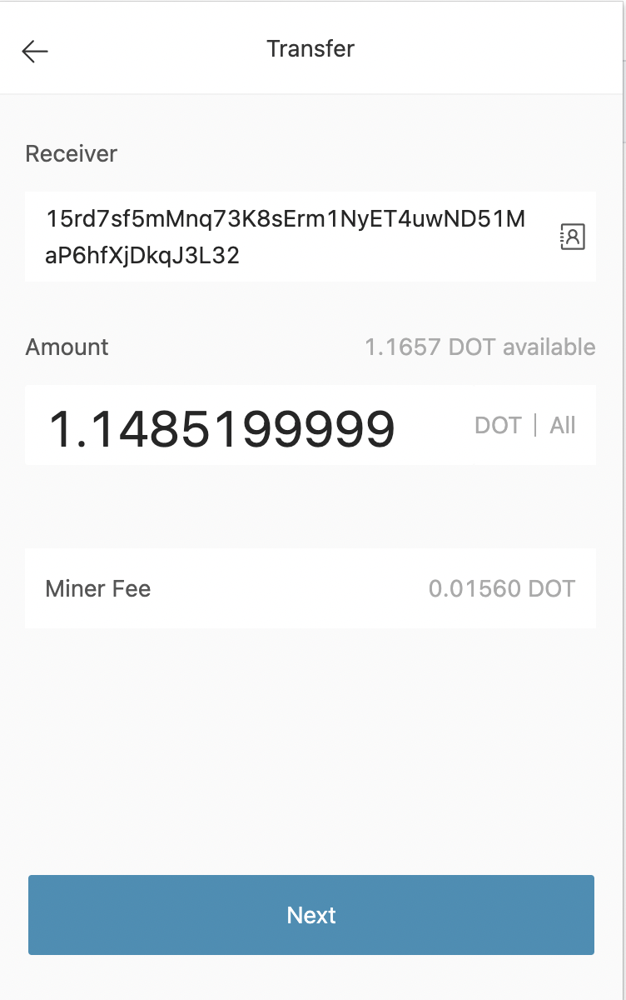
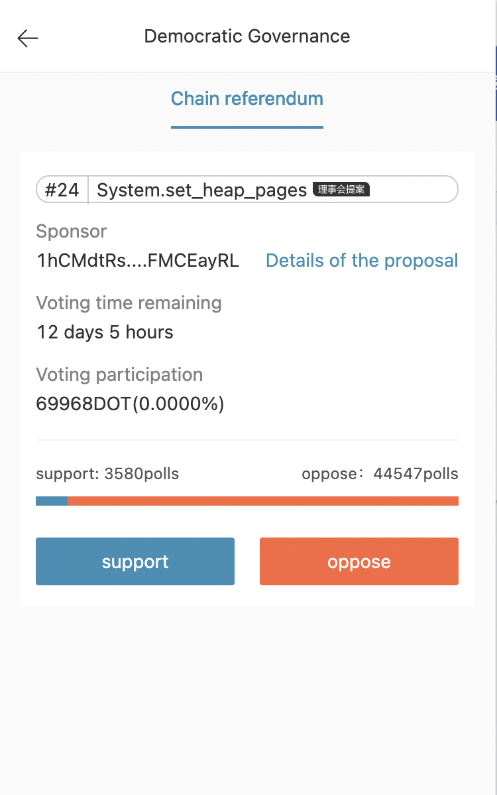

# What is Doter
Doter is a chrome wallet extension for polkadot ecosystem. User can import or create the accounts with the wallet, and to transfer dot to some other account or join in the ecosystem governance.  
## the home page

## transfer

## referendum

# How To Develop
1. `yarn install` to install the dependencies  
2. `yarn dll` to build dll files
3. `yarn build` to build the extension, then the bundle results will be in the `plugin` file 
4. Install the extension
    - go to `chrome://extensions/`
    - ensure you have the Development flag set
    - "Load unpacked" and point to `plugin`
    - if developing, after making changes - refresh the extension