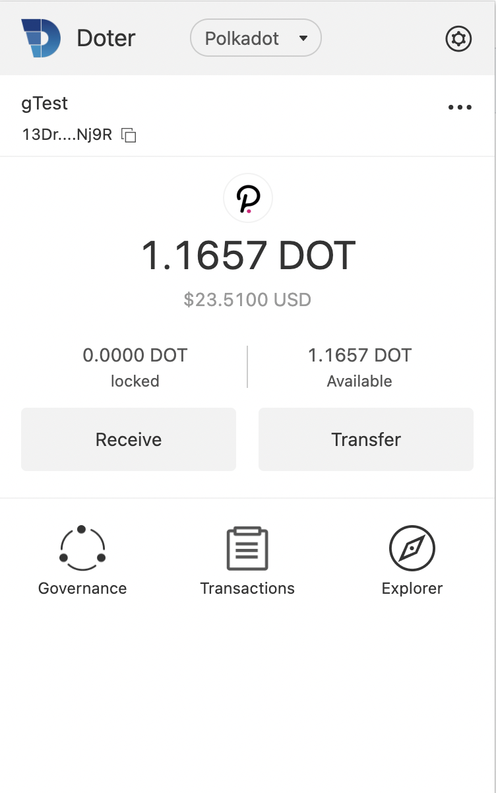

# What is Doter
Doter is a chrome wallet extension for polkadot ecosystem. User can import or create the accounts with the wallet, and to transfer dot to some other account or join in the ecosystem governance.  
## the home page

## transfer

## referendum

# Installation

- On Chrome, install via [Chrome web store](https://chrome.google.com/webstore/detail/doter/abamjefkidngfegdjbmffdmbgjgpaobf)

# How To Develop
1. `yarn install` to install the dependencies  
2. `yarn dll` to build dll files
3. `yarn build` to build the extension, then the bundle results will be in the `plugin` file 
4. Install the extension
    - go to `chrome://extensions/`
    - ensure you have the Development flag set
    - "Load unpacked" and point to `plugin`
    - if developing, after making changes - refresh the extension

# How to Use
With the launch of Polkadot Parachain, the browser extension wallet, as an infrastructure, will play an important role in the interaction between Polkadot and parachain. However, the application market currently lacks an experience-friendly Polkadot browser extension wallet, so Doter came into being.  

We are committed to building Doter into a truly user-centric browser extension wallet, attracting users to participate in the Polkadot ecosystem by providing a clear and concise UI experience and rich on-chain governance functions.  

Now, we can already install Doter in the Google Chrome extension market.    

If you want to use Doter to participate in the Polkadot ecology, you can refer to the following tutorial：  
1. Create wallet  
1)Please choose a language you are familiar with before creating a wallet. There are currently two options: English and Chinese. Then click the Create Wallet button  
  
2)This password will be used as the transaction password for the wallet，Please remember the password，Doter is a decentralized wallet and cannot provide password retrieval function  
  
3)Be sure to back up the mnemonic phrase, Don’t take screenshots  
  
4)Please enter the mnemonic words you just backed up in order to make sure you back them up correctly  
  
5)Congratulations, seeing this page means that you have successfully created a wallet. The operation of the wallet homepage is shown in the figure below  
  

2. Receive  
Just click Receive on the homepage to jump to this page. Scan the QR code, or copy the wallet address by clicking Copy  
  

3. Transfer  
1)Just click Transfer on the homepage to jump to this page. Enter the recipient's wallet address and transfer amount, click Next  
  
2)After ensuring that the transfer information is correct, enter the password to confirm, Wait a moment and the transfer will be completed  
  
3)Just click Transactions on the homepage to jump to this page. You can see all transaction records  
  

4. Governance
Just click Governance on the homepage to jump to this page. The governance module includes three parts: on-chain referendum, community proposal, and council election. At present, you can use the on-chain referendum module to vote on proposals from the community or council. The other two governance modules will be developed soon  
  

The above is all the tutorials.
Our Twitter account: @ChainBridgeNetwork, if you have any suggestions, you can interact with us on Twitter.